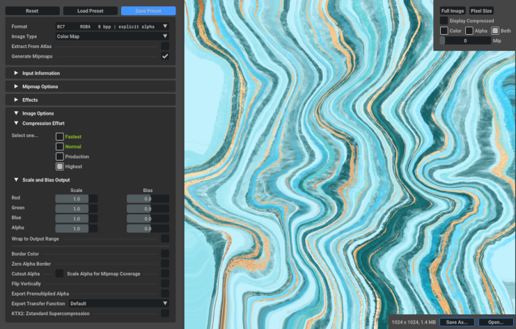
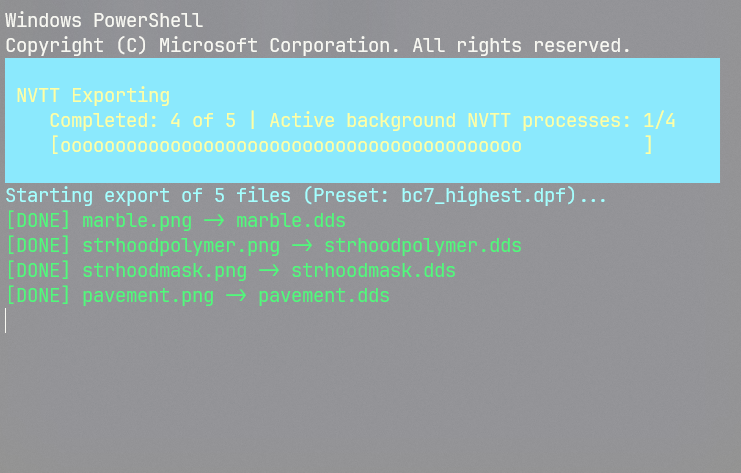
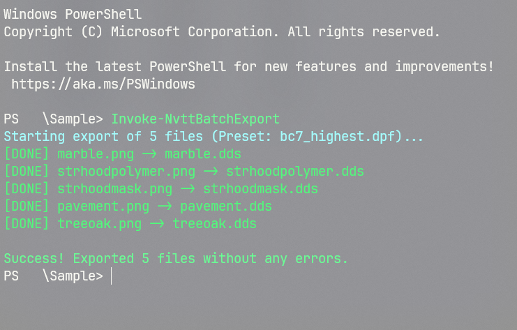

# NVIDIA Texture Tools (NVTT) Exporter aka NVTTExporter
NVTT Exporter is a PowerShell module designed to automate the batch conversion of textures to the DDS format. Acting as a wrapper for the official NVIDIA Texture Tools Exporter, it streamlines game development workflows by enabling fast, multithreaded processing of multiple image files simultaneously without the need to manually configure a pipeline for each, single texture.

## Installation instructions
1. Clone this repository or download its zipped version.
2. Extract the contents into a folder named `NVTTExporter`.
3. Place the `NVTTExporter` folder into your PowerShell modules dir (e.g., `C:\Users\<YourUserName>\Documents\WindowsPowerShell\Modules\`).
4. If your system restricts running scripts, open PowerShell and execute the following command to allow local modules to load (this does not require Administrator privileges):
```powershell
Set-ExecutionPolicy RemoteSigned -Scope CurrentUser
```

## Main features
* **Automated Batch Processing:** Convert thousands of textures to `.dds` with a single command.
* **Multithreading:** Process multiple textures simultaneously using the `-MaxParallelJobs` parameter to drastically reduce export times.
* **Auto-Discovery:** Automatically locate your NVIDIA Texture Tools installation via the Windows Registry or system variables with a `-ExporterPath` param fallback.
* **Preset Support:** Make use of standard NVTT `.dpf` preset files to apply specific advanced settings to your batches.
* **Safe Interruption:** Safely abort the batch process at any time using `Ctrl+C` without leaving orphaned background processes.
* **Multilingual Interface:** Localized console output supporting English, Polish, German and French.

## Requirements
To use this module, you must have the following installed on your system:
* **[PowerShell 5.1 or newer](https://learn.microsoft.com/en-us/powershell/scripting/install/installing-powershell-on-windows)**
* **[NVIDIA Texture Tools Exporter](https://developer.nvidia.com/texture-tools-exporter)** (the module automatically detects `nvtt_export.exe`, but it must be installed on your machine)

## Usage
The module is designed to be as simple as possible. To start exporting textures with default settings (processing `*.png` files using a `.dpf` preset found in the same folder):

1. Create your own preset - `.dpf` - directly from within `nvtt_export.exe`.

    

2. Open PowerShell and navigate to the directory containing your images and `.dpf` preset file. Run the main command: `Invoke-NvttBatchExport`

    

3. Wait until the tool finishes.

    

### Advanced parameters
You can customize the export process by using additional parameters:

```powershell
Invoke-NvttBatchExport -SourceDirectory "X:\Dev\Textures" -Filter "*.tga" -MaxParallelJobs 16 -PresetFile "X:\Dev\Config\bc7_ultra.dpf"
```
* `-SourceDirectory`: The folder containing your textures (defaults to the current working directory).
* `-Filter`: The file types to process (defaults to `*.png`), can be also used to differentiate maps, e.g. `*_n.png` or `*_m.png`.
* `-MaxParallelJobs`: Number of concurrent export processes (defaults to 4).
* `-PresetFile`: Path to a specific `.dpf` preset (auto-detected if a `.dpf` file is present in the source directory).
* `-ExporterPath`: Manually specify the path to `nvtt_export.exe` if auto-discovery fails.

## Permissions
Please be advised that for now this software is proprietary and is not distributed under a standard open-source agreement. For comprehensive details regarding permitted usage, strict prohibitions on redistribution, restrictions on modifications, and other legal terms, please refer directly to the [End-User License Agreement (LICENSE)](LICENSE) included within this repository.

## Shout outs
* **NVIDIA** for providing the core Texture Tools Exporter software.
